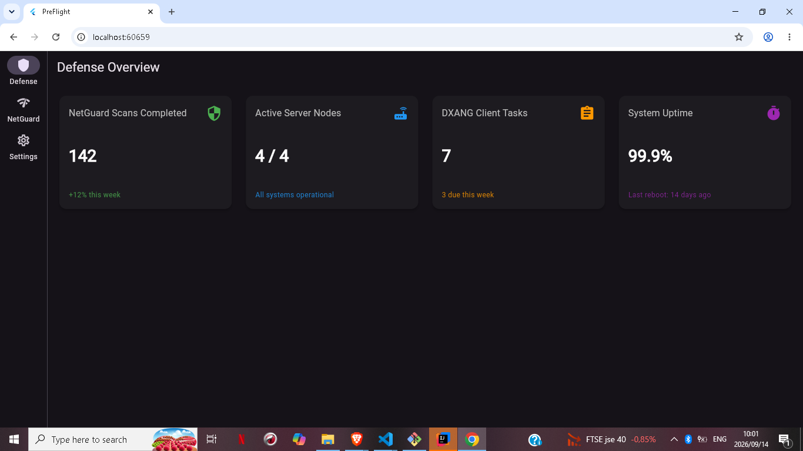
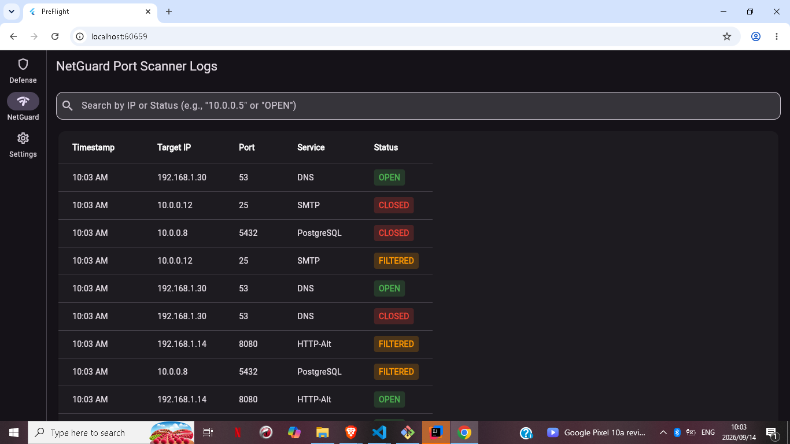
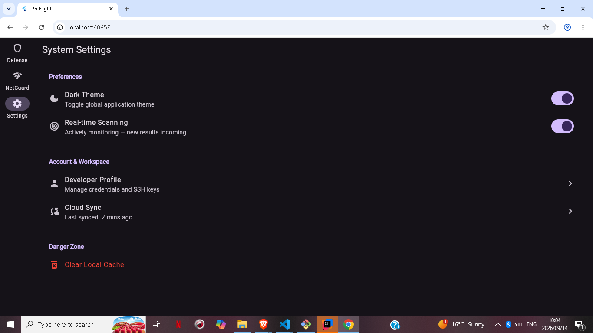
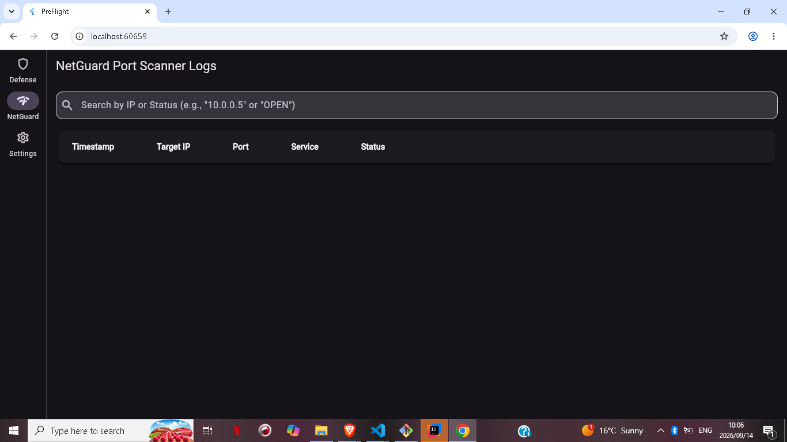

# PreFlight (NetGuard)

A network security monitoring dashboard, built for the WeThinkCode Mobile Development elective (Track 1: Flutter + Dart fundamentals).

## Problem

Small teams, home networks, and student projects rarely have visibility into their own network security posture. Enterprise SOC tools are expensive and complex. PreFlight demonstrates the core idea of one at a lightweight, approachable scale - know what's open, what's closed, and what's being actively monitored, at a glance.

## Features

- Defense Dashboard - at-a-glance metrics (active scans, node count, uptime)
- NetGuard Logs - a live, sortable, searchable table of port-scan results
- Real-time Scanning - toggle simulated live monitoring on and off; new results stream in automatically via a background timer
- Persistence - scan history and scanning state survive a page refresh (local storage)
- Clear Local Cache - reset scan history with a confirmation step
- Dark and light theme toggle
- Responsive layout - NavigationRail on desktop, Drawer menu on mobile

## Tech Stack

- Flutter (web target, Chrome)
- Dart
- State management: StatefulWidget with state lifted to DashboardShell
- shared_preferences for local persistence
- Timer.periodic for simulated live scanning

## Run It

    flutter pub get
    flutter run -d chrome

## Screenshots

### Defense Dashboard

### NetGuard - Live Scanning

### Settings

### Cache Cleared

## Wiki

Full project documentation, architecture notes, and a session-by-session development log are available on the [project wiki](https://github.com/lichumestandard-sudo/flutter-track1-devboard/wiki).
